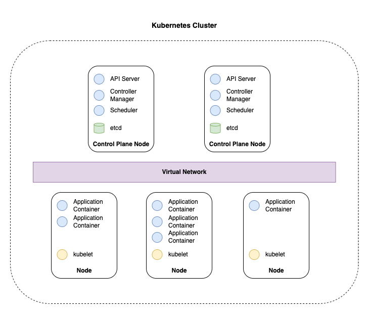

# practice-kubernetes

This is a collection of notes and examples written while roughly following [Nana's Kubernetes Crach Course](https://www.youtube.com/watch?v=s_o8dwzRlu4) and the [Kubernetes official documentation](https://kubernetes.io/docs/home/).

Technologies used:

* minikube: 1.25.1
* docker: 20.10.11

## **Components**

### Pod

<u>**A Pod is an abstraction over container.**</u>

Kubernetes wants to abstract away the container technology so that it can be replaced/forgotten about, thus **Pods** allow the administrator to interact with the Kubernetes layer exclusively.

* Smallest unit in Kubernetes
* Usually 1 application per Pod
* Pods are ephemeral
* Each pod gets its own IP address
* Pods get a new IP address on recreation

### Service

**<u>A Service is a permanent IP address that references a specific Pod.</u>**

Because each pod has its own IP address and is expected to die at any moment (ephemeral), **Services** are used to interact with **Pods**.

* Can be configured to be external/internal (public/private)

### Ingress

**<u>Ingress is a forwarding component that forwards a domain name to a service.</u>**

* Enables public facing domains and more secure protocols (https)

### ConfigMap

**<u>ConfigMap persists the external configuration of applications.</u>**

* Manages configuration data passed through to applications as environment variables
* For non-confidential data only (exposes data as plain-text)

### Secret

**<u>Secret works with ConfigMap to persist confidental configuration.</u>**

* Persists configuration data in base64 (by default store unencrypted in the Kubernetes API server's underlying data store etcd).
* Can be referenced in Deployments/Pods
* **WARNING**: Anyone with API/etcd access can retrieve or modify a Secret
* **WARNING**: Anyone authorised to create a Pod in a namespace can use that access to read any Secret in that namespace, including indirect access such as deployment permissions
* The following steps should be followed to safely use Secrets:
  * Enable encryption at rest for Secrets
  * Enable or configure RBAC rules that restrict reading data in Secrets
  * Enable or configure RBAC mechanisms to limit which principles are allowed to create new Secrets or replace existing ones

### Volume

**<u>Volumes attaches a physical storage to a Pod.</u>**

* Can be local (kubernetes cluster) or remote (on-prem, cloud, etc)
* **WARNING**: Kubernetes doesn't manage data persistence. The Administrator is responsible for things like:
  * Back ups
  * Replication

### Deployment

**<u>A Deployment is a blueprint for how a Pod should be deployed.</u>**

* Defining blueprints enables Pod management features like:
  * replication
  * scaling
  * multi-pod configuration
* Designed to manage stateless applications (via Pods)

### StatefulSet

**<u>A StatefulSet is a blueprint for how a STATEFUL Pod should be deployed.</u>**

* Enables similar features for Deployments for stateful applications
* More complex than Deployments (DBs are often hosted outside of the Kubernetes cluster)

### DaemonSet

<u>**A DaemonSet is a resource manager that ensures nodes have a certain set of Pods as a minimum.**</u>

* Often used to ensure utility nodes are always available on pods (logging nodes, monitoring nodes, persistent storage nodes, etc)
* Self garbage collecting

## Architecture

A Kubernetes cluster is made up of master nodes and worker nodes, connected by a virtual network.



Worker nodes are generally bigger and designed to handle high workloads:

* **Kublet (kubernetes process)** - Allows cross node communication
* **Application container(s) (Usually Docker)** - Runs application

Master nodes are generally smaller and only run a handful or master processes:

* **API server** - Entrypoint to the cluster (UI, API, CLI)
* **Controller manager** - Maintains the cluster (Repairs/restarts containers)
* **Scheduler** - Scales up and down worker nodes based on load
* **etcd** - Kubernetes persistent store for configuration data and node/container data (backup and restore can use this as a snapshot to generate new cluster)

Virtual network:

* Links the Kubernetes cluster to create "one unified machine"

## Start the cluster locally

Start minikube:

```bash
start minikube
```

Create the configmap:

```bash
kubectl apply -f demo-node-mongodb-application/mongo-config.yaml
```

Create the secret:

```bash
kubectl apply -f demo-node-mongodb-application/mongo-secret.yaml
```

Create the mongo-db deployment and service:

```bash
kubectl apply -f demo-node-mongodb-application/mongo.yaml
```

Create the web-app deployment and service:

```bash
kubectl apply -f demo-node-mongodb-application/webapp.yaml
```


## Useful Commands

Get all kubernetes components:

```bash
kubectl get all
```

Base64 encode string in the terminal (for secrets):

```bash
echo -n string_to_encode | base64
```

